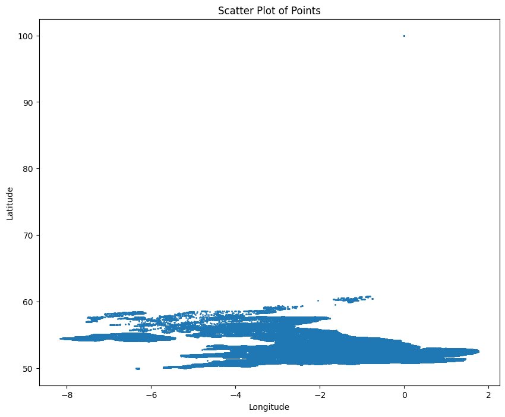
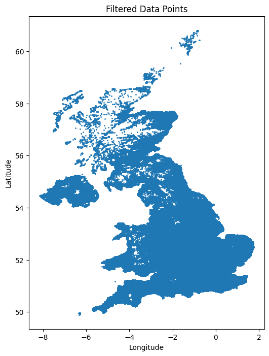

# This is a sample Jupyter Notebook

Below is an example of a code cell. 
Put your cursor into the cell and press Shift+Enter to execute it and select the next one, or click 'Run Cell' button.

Press Double Shift to search everywhere for classes, files, tool windows, actions, and settings.

To learn more about Jupyter Notebooks in PyCharm, see [help](https://www.jetbrains.com/help/pycharm/ipython-notebook-support.html).
For an overview of PyCharm, go to Help -> Learn IDE features or refer to [our documentation](https://www.jetbrains.com/help/pycharm/getting-started.html).


```python
print("Hello World!")

```

    Hello World!


```python
import pandas as pd
```


```python
df = pd.read_csv("data/ukpostcodes.csv")
```


```python
df.head()
```


<div>
<style scoped>
    .dataframe tbody tr th:only-of-type {
        vertical-align: middle;
    }

    .dataframe tbody tr th {
        vertical-align: top;
    }

    .dataframe thead th {
        text-align: right;
    }
</style>
<table border="1" class="dataframe">
  <thead>
    <tr style="text-align: right;">
      <th></th>
      <th>id</th>
      <th>postcode</th>
      <th>latitude</th>
      <th>longitude</th>
    </tr>
  </thead>
  <tbody>
    <tr>
      <th>0</th>
      <td>1</td>
      <td>AB10 1XG</td>
      <td>57.144165</td>
      <td>-2.114848</td>
    </tr>
    <tr>
      <th>1</th>
      <td>2</td>
      <td>AB10 6RN</td>
      <td>57.137880</td>
      <td>-2.121487</td>
    </tr>
    <tr>
      <th>2</th>
      <td>3</td>
      <td>AB10 7JB</td>
      <td>57.124274</td>
      <td>-2.127190</td>
    </tr>
    <tr>
      <th>3</th>
      <td>4</td>
      <td>AB11 5QN</td>
      <td>57.142701</td>
      <td>-2.093295</td>
    </tr>
    <tr>
      <th>4</th>
      <td>5</td>
      <td>AB11 6UL</td>
      <td>57.137547</td>
      <td>-2.112233</td>
    </tr>
  </tbody>
</table>
</div>


```python
df
```


<div>
<style scoped>
    .dataframe tbody tr th:only-of-type {
        vertical-align: middle;
    }

    .dataframe tbody tr th {
        vertical-align: top;
    }

    .dataframe thead th {
        text-align: right;
    }
</style>
<table border="1" class="dataframe">
  <thead>
    <tr style="text-align: right;">
      <th></th>
      <th>id</th>
      <th>postcode</th>
      <th>latitude</th>
      <th>longitude</th>
    </tr>
  </thead>
  <tbody>
    <tr>
      <th>0</th>
      <td>1</td>
      <td>AB10 1XG</td>
      <td>57.144165</td>
      <td>-2.114848</td>
    </tr>
    <tr>
      <th>1</th>
      <td>2</td>
      <td>AB10 6RN</td>
      <td>57.137880</td>
      <td>-2.121487</td>
    </tr>
    <tr>
      <th>2</th>
      <td>3</td>
      <td>AB10 7JB</td>
      <td>57.124274</td>
      <td>-2.127190</td>
    </tr>
    <tr>
      <th>3</th>
      <td>4</td>
      <td>AB11 5QN</td>
      <td>57.142701</td>
      <td>-2.093295</td>
    </tr>
    <tr>
      <th>4</th>
      <td>5</td>
      <td>AB11 6UL</td>
      <td>57.137547</td>
      <td>-2.112233</td>
    </tr>
    <tr>
      <th>...</th>
      <td>...</td>
      <td>...</td>
      <td>...</td>
      <td>...</td>
    </tr>
    <tr>
      <th>1738238</th>
      <td>2587701</td>
      <td>M30 0YG</td>
      <td>53.486858</td>
      <td>-2.359106</td>
    </tr>
    <tr>
      <th>1738239</th>
      <td>2587702</td>
      <td>M30 0YH</td>
      <td>53.485078</td>
      <td>-2.359377</td>
    </tr>
    <tr>
      <th>1738240</th>
      <td>2587703</td>
      <td>M30 3AX</td>
      <td>53.482717</td>
      <td>-2.336904</td>
    </tr>
    <tr>
      <th>1738241</th>
      <td>2587704</td>
      <td>KA3 3BF</td>
      <td>55.678146</td>
      <td>-4.523208</td>
    </tr>
    <tr>
      <th>1738242</th>
      <td>2587705</td>
      <td>KA3 6GQ</td>
      <td>55.637910</td>
      <td>-4.473551</td>
    </tr>
  </tbody>
</table>
<p>1738243 rows × 4 columns</p>
</div>


```python
import matplotlib.pyplot as plt

# Scatter plot of all data points
plt.figure(figsize=(10, 8))
plt.scatter(df["longitude"], df["latitude"], s=1)
plt.title("Scatter Plot of Points")
plt.xlabel("Longitude")
plt.ylabel("Latitude")
plt.show()
```


    

    


```python
# Find the min and max values for latitude and longitude
lat_min = df["latitude"].min()
lat_max = df["latitude"].max()
lon_min = df["longitude"].min()
lon_max = df["longitude"].max()

print(f"Latitude range: {lat_min} to {lat_max}")
print(f"Longitude range: {lon_min} to {lon_max}")
```

    Latitude range: 49.895171 to 99.999999
    Longitude range: -8.163139 to 1.76044318426187


```python
# Define initial bounds based on your observations
lat_lower_bound = 49  # Modify based on scatter plot
lat_upper_bound = 61  # Modify based on scatter plot
lon_lower_bound = -9  # Modify based on scatter plot
lon_upper_bound = 2   # Modify based on scatter plot

# Filter the data
filtered_in_data = df[
    (df["latitude"] >= lat_lower_bound) &
    (df["latitude"] <= lat_upper_bound) &
    (df["longitude"] >= lon_lower_bound) &
    (df["longitude"] <= lon_upper_bound)
]

filtered_out_data = df[
    (df["latitude"] < lat_lower_bound) |
    (df["latitude"] > lat_upper_bound) |
    (df["longitude"] < lon_lower_bound) |
    (df["longitude"] > lon_upper_bound)
]
print(filtered_in_data.size)
print(filtered_out_data.size)
print(filtered_out_data.head())
print(filtered_out_data.tail())

print(df.latitude.max())
print(df.latitude.min())
print(df.longitude.max())
print(df.longitude.min())

# filtered_out_data = df[
#     (df["latitude"] < lat_lower_bound) &
#     (df["latitude"] > lat_upper_bound) &
#     (df["longitude"] < lon_lower_bound) &
#     (df["longitude"] > lon_upper_bound)
# ]
# print(filtered_in_data)

# Plot filtered data
plt.figure(figsize=(6, 8))
plt.scatter(filtered_in_data["longitude"], filtered_in_data["latitude"], s=1)
plt.title("Filtered Data Points")
plt.xlabel("Longitude")
plt.ylabel("Latitude")
plt.show()
```

    6952432
    540
                  id  postcode   latitude  longitude
    1467109  1538687  BN91 9AA  99.999999        0.0
    1534108  1608927  BD98 1GA  99.999999        0.0
    1534109  1608928  BD98 1GB  99.999999        0.0
    1534110  1608929  BD98 1GD  99.999999        0.0
    1534111  1608930  BD98 1GG  99.999999        0.0
                  id  postcode   latitude  longitude
    1696440  1784194  WV98 2AZ  99.999999        0.0
    1726396  1960140  BT20 9EH  99.999999        0.0
    1726400  1960149  BT20 9EW  99.999999        0.0
    1727114  2002738  BT36 9DS  99.999999        0.0
    1730044  2578364   EX6 9AA  99.999999        0.0
    99.999999
    49.895171
    1.76044318426187
    -8.163139


    

    


```python

```


```python

```
